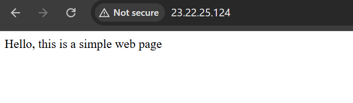

# CI/CD Pipeline to AWS ECS with Terraform - a DevOps Project

## Summary
This project automates the end-to-end deployment of a Dockerized Flask application to **AWS Elastic Container Service (ECS)**.  
It follows modern DevOps best practices including **Infrastructure as Code (IaC)**, **containerization**, **continuous integration / continuous deployment (CI/CD)**, and **continuous monitoring**.

## Skills Demonstrated
- Python
- Docker
- AWS ECR
- AWS ECS (Fargate)
- Terraform
- GitHub Actions
- Amazon CloudWatch

## Architecture

This project uses a modular, production-style architecture utilizing AWS services:

- **Flask App** – A lightweight Python web application serving HTTP requests
- **Docker** – The app is containerized using a `Dockerfile`
- **AWS ECR** – Stores the Docker image built from the Flask app
- **Terraform** – Provisions the entire infrastructure:
  - **Networking** – VPC, Subnet, Internet Gateway, Route Table, Security Group
  - **Compute** – ECS Cluster (Fargate), ECS Service, Task Definition
  - **Monitoring** – CloudWatch Log Group, Alarms (CPU, health check), SNS for email notifications
- **GitHub Actions (CI/CD)** – On every push to the `main` branch:
  1. Builds the Docker image
  2. Pushes it to ECR
  3. Deploys the updated image to ECS automatically

<p align='center'>

</p>

## How to Run This Project

### 1. Clone the repository

```
git clone git@github.com:AfsahSiddiqui/AWS-ECS-Terraform-GitHub-Actions-Pipeline.git
cd AWS-ECS-Terraform-GitHub-Actions-Pipeline
```


### 2. Locally test the Dockerized image
```
docker build -t flask-app .
docker run -d -p 80:80 flask-app
curl http://localhost
curl http://localhost/poem
```

### 3. Configure AWS CLI and Create ECR Repository
```
aws cli
aws ecr create-repository --repository-name flask-app
```

### 4. Push the image to ECR
```
aws ecr get-login-password --region us-east-1 | docker login --username AWS --password-stdin <AWS-Account-ID>.dkr.ecr.us-east-1.amazonaws.com
docker tag flask-app:latest <AWS-Account-ID>.dkr.ecr.us-east-1.amazonaws.com/flask-app:latest
docker push <AWS-Account-ID>.dkr.ecr.us-east-1.amazonaws.com/flask-app:latest 
```

### 5. Permissions for IAM User

To provision the infrastructure successfully in AWS, add these permission policies to your IAM user

- `AmazonVPCFullAccess`
- `AmazonECS_FullAccess`
- `IAMFullAccess`
- `AmazonSNSFullAccess`
- `CloudWatchFullAccess`

### 6. Edit `variables.tf` file
```
cd terraform
vim variables.tf # Replace the default value of `image_url` variable with your full ECR image url. 
                 # e.g. <AWS-Account-ID>.dkr.ecr.us-east-1.amazonaws.com/flask-app:lates"
                 # Also replace default value of `email_address` variable with your email address 
```

### 7. Provision the AWS Infrastructure with Terraform
```
terraform init
terraform apply
```
### 8. Create GitHub Repository and Set Up GitHub Secrets for CI/CD

- Create a repository in your GitHub account
- Then add these secrets in your repository settings: Repo settings -> Secrets and variables -> Actions -> New repository secret

  - `AWS_ACCESS_KEY_ID`
  - `AWS_SECRET_ACCESS_KEY_ID`
  - `ECS_CLUSTER_NAME` : e.g. `flask-app-cluster`
  - `ECS_SERVICE_NAME` : e.g. `flask-app-service`
  - `AWS_REGION` : e.g. `us-east-1`
  - `ECR_REGISTRY` : e.g. `<AWS-Account-ID>.dkr.ecr.us-east-1.amazonaws.com`
  - `ECR_REPO_NAME` : e.g. `flask-app`


### 9. Push code to GitHub
```
- git add .
- git commit -m "your commit message"
- git remote add origin <Your-Repo-URL>
- git push -u origin main
```
***Now every push to `main` will automatically build and deploy via GitHub Actions***

## Screenshots

Below are the screenshots taken during various phases of the project deployment and testing:

**Image in ECR**
<p align='center'>

</p>

### ECS Deployment

**ECS Cluster**
<p align='center'>

</p>

**ECS Service**
<p align='center'>

</p>

**Running Task of the Service**
<p align='center'>

</p>

**Live Web Application**
<p align='center'>

</p>

**The `/poem` Web Subpage**
<p align='center'>

</p>


### AWS CloudWatch + SNS Notifications
 
**Email Confirmation from AWS SNS**
<p align='center'>

</p>

**AWS CloudWatch Alarms Created**
<p align='center'>

</p>

**Triggered Alarm Notification Email**
<p align='center'>

</p>

### CI/CD Pipeline Test

**Edited `app/main.py` to Trigger Deployment**
<p align='center'>

</p>

**Updated Image Pushed to ECR After Git Push**
<p align='center'>

</p>

**Live Web Application Updated Automatically**
<p align='center'>

</p>

**GitHub Actions Workflow Run**
<p align='center'>

</p>


